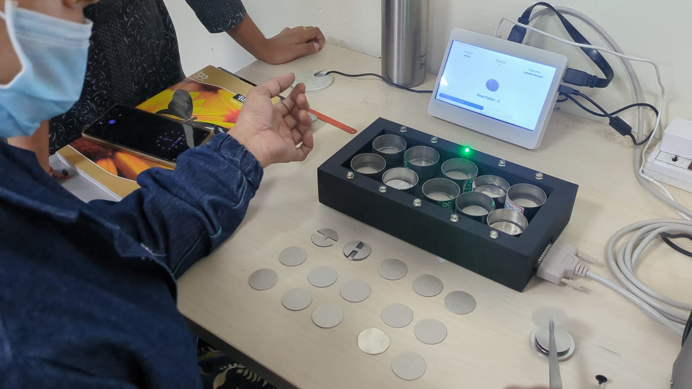

# Thermal-Battery Assembly Guidance (**TBAG**)

<p align="center">

</p>
<p align="center">

</p>


End‑to‑end “shop‑floor” guidance system for assembling lithium
thermal batteries.
Runs on a **Raspberry Pi** inside the glove‑box, drives coloured LEDs to
indicate the *current* component, accepts hands‑free *Next / Abort*
commands via a USB foot‑switch and records every session in an SQLite
log that supervisors can review from any browser.

```
               ┌──────────────┐
               │  Admin PC    │  http(s)://res-stack.weberq.in
               └──────────────┘
                       ▲
                       │ web UI + JSON
                       ▼
┌────────────┐  GPIO ┌─────────┐  USB HID ┌───────────┐
│  RPi 4     │──────▶│ coloured│◀─────────│ foot pedal│
│  (Gunicorn)│       │  LEDs   │           └───────────┘
└────────────┘       └─────────┘
```

---

## ✨  Key features

| Area              | Highlights                                                                                                                                |
| ----------------- | ----------------------------------------------------------------------------------------------------------------------------------------- |
| **Operator UI**   | • Kiosk‑style single page<br>• Live component preview + LED guidance<br>• Foot‑switch (USB) = *space bar*<br>• Last‑step review & summary |
| **Supervisor UI** | • Admin dashboard (sessions, projects, components)<br>• Live queue manager<br>• XLSX export                                               |
| **Hardware**      | • Any RPi (tested on 4 & 3B+)<br>• Simple 3 mm LEDs + 330 Ω resistors<br>• Optional industrial USB foot pedal                             |
| **Backend**       | • Flask / Gunicorn<br>• SQLite DB (no server needed)<br>• REST‑ish JSON endpoints                                                         |
| **Remote access** | • Cloudflare Tunnel recipe included *(optional)*                                                                                          |
| **Deployment**    | • `systemd` service → auto‑start & watchdog                                                                                               |

---

## 🛠️  Quick‑start (dev / PC)

```bash
git clone https://github.com/Renewable-Energy-Systems/Thermal-Battery-Assembly-Guidance.git tbag
cd tbag
python -m venv .venv && source .venv/bin/activate
pip install -r requirements.txt
export FLASK_APP=app.py
flask run
```

Browse to **[http://localhost:5000](http://localhost:5000)** and start adding
**Projects → Components → Sessions**.

---

## 🐙  Production recipe (Raspberry Pi)

1. **Prepare OS & deps**

   ```bash
   sudo apt update && sudo apt install git python3-venv libgpiod2
   ```

2. **Clone + set‑up venv**

   ```bash
   git clone https://github.com/Renewable-Energy-Systems/Thermal-Battery-Assembly-Guidance.git ~/ags
   cd ~/ags
   python3 -m venv .venv && source .venv/bin/activate
   pip install -r requirements.txt gunicorn
   ```

### 3a  Backend service

`/etc/systemd/system/tbag.service`

```ini
[Unit]
Description=TBAG Flask backend (Gunicorn)
After=network.target

[Service]
User=pi
WorkingDirectory=/home/pi/ags
Environment="PATH=/home/pi/ags/.venv/bin"
ExecStart=/home/pi/ags/.venv/bin/gunicorn -b 0.0.0.0:8000 \
          --workers 3 --timeout 90 app:app
Restart=on-failure
RestartSec=3

[Install]
WantedBy=multi-user.target
```

```bash
sudo systemctl daemon-reload
sudo systemctl enable --now tbag
```

### 3b  Kiosk window (Chromium Snap, **single‑instance**)

`~/.config/systemd/user/kiosk-chromium.service`

```ini
[Unit]
Description=Chromium kiosk (single window)
After=graphical-session.target network-online.target
Wants=network-online.target
PartOf=graphical-session.target

[Service]
Environment=DISPLAY=:0
Environment=XAUTHORITY=%h/.Xauthority

# ensure only ONE kiosk window
ExecStartPre=-/usr/bin/pkill -f '/snap/bin/chromium.*--app=http://127.0.0.1:8000'

ExecStart=/snap/bin/chromium \
          --app=http://127.0.0.1:8000 \
          --kiosk --incognito --noerrdialogs \
          --disable-session-crashed-bubble \
          --disable-restore-session-state \
          --no-first-run

# after 5 s kill any “session‑restore” duplicate
ExecStartPost=/usr/bin/bash -c 'sleep 5; \
  mapfile -t p < <(pgrep -f "/snap/bin/chromium.*--app=http://127.0.0.1:8000"); \
  [ ${#p[@]} -gt 1 ] && kill "${p[@]:1}" || true'

Restart=on-failure
RestartSec=3

[Install]
WantedBy=graphical-session.target
```

Enable it **once logged‑in on the Pi’s desktop**:

```bash
systemctl --user daemon-reload
systemctl --user enable --now kiosk-chromium.service
```

4. **Wire LEDs**

   | GPIO | Colour | Component   |
   | ---- | ------ | ----------- |
   | 17   | Red    | Anode       |
   | 4    | Blue   | Cathode     |
   | 25   | Green  | Electrolyte |
   | …    | …      | …           |

   *330 Ω resistor → LED → GND.
   Pin numbers are configured per component in
   `components/<cid>/config.json`.*

5. **USB foot‑switch**

   *Any* programmable HID pedal works.
   Program it to emit a **space bar**:

   * short press < 10 s → “Next / Review”
   * long  press ≥ 10 s → “Force Stop”

6. **(Optional) expose over the internet**

   ```bash
   curl -L \
     https://github.com/cloudflare/cloudflared/releases/latest/download/cloudflared-linux-arm64.deb \
     -o cf.deb
   sudo apt install ./cf.deb
   sudo cloudflared tunnel login
   sudo cloudflared tunnel create res-stack
   sudo cloudflared tunnel route dns res-stack yoursub.weberq.in
   ```

   `/etc/cloudflared/config.yml`

   ```yaml
   tunnel: res-stack
   credentials-file: /home/pi/.cloudflared/res-stack.json

   ingress:
     - hostname: yoursub.weberq.in
       service: http://localhost:8000
     - service: http_status:404
   ```

   ```bash
   sudo systemctl enable --now cloudflared
   ```

---

## 📂  Project layout

```
ags/
├─ app.py                  ← Flask bootstrap
├─ tbag/
│  ├─ blueprints/          ← UI + API endpoints
│  ├─ helpers/             ← tiny pure‑Python libs
│  ├─ gpio.py              ← LED / Button wrapper (mock‑friendly)
│  ├─ db.py                ← SQLite migrations & helpers
│  └─ config.py            ← secrets, device ID, build stamp …
├─ components/             ← user‑added component defs
├─ projects/               ← project JSONs (sequences)
├─ static/                 ← CSS / JS / logo
└─ templates/              ← Jinja2 pages
```

---

## 🔧  Configuration

| Variable               | Default        | Description                                                              |
| ---------------------- | -------------- | ------------------------------------------------------------------------ |
| `DEVICE_ID`            | `glovebox‑pi`  | Written into each DB record                                              |
| `SECRET`               | generated UUID | Flask session key                                                        |
| `GPIOZERO_PIN_FACTORY` | `lgpio`        | Use [`lgpio`](https://github.com/gpiozero/lgpio) backend (fast, no sudo) |

Define via `.env` or directly inside your `systemd` unit.

---

## 👟  Foot‑switch logic (JS)

| Action          | Condition    | Key               | Effect                                  |
| --------------- | ------------ | ----------------- | --------------------------------------- |
| `NEXT / REVIEW` | press ≤ 10 s | **space** *keyup* | `/api/progress` `next`                  |
| `FORCE STOP`    | hold ≥ 10 s  | **space** held    | Clicks *Stop* → `/api/progress` `abort` |

Implementation: [`static/script.js`](static/script.js) (v4.6).

---

## 🚑  Basic troubleshooting

| Symptom                                        | Check                                                                   |
| ---------------------------------------------- | ----------------------------------------------------------------------- |
| **LED stays on / GPIO busy**                   | `_reset_all_leds()` runs every step.<br>Still stuck? `sudo lgpioreset`. |
| **Summary page 404**                           | Ensure `/api/progress` sends `"finish"` **before** redirect.            |
| **Tunnel works but local 192.168 … preferred** | Operators bookmark `http://<Pi‑IP>:8000`; public URL is fallback.       |

---

## 🗄️  Automated nightly backups *(DB + components + projects)*

A lightweight script runs as a **systemd timer** and ships the following
artefacts to OneDrive (folder `tbag-backups/`):

| File               | Contents                 | Example name                            |
| ------------------ | ------------------------ | --------------------------------------- |
| SQLite snapshot    | `events.db` (consistent) | `tbag_2025-08-07_16-34_31.sqlite3.gz`   |
| Components tarball | `tbag/components/`       | `components_2025-08-07_16-34_31.tar.gz` |
| Projects tarball   | `tbag/projects/`         | `projects_2025-08-07_16-34_31.tar.gz`   |

```bash
# /usr/local/bin/backup-tbag.sh (excerpt)
DB_SRC="/home/res-stack/ags/events.db"
COMPONENTS_DIR="/home/res-stack/ags/tbag/components"
PROJECTS_DIR="/home/res-stack/ags/tbag/projects"
TMP_DIR="/tmp/tbag-backup"
REMOTE="onedrive:tbag-backups"

# ① SQLite .backup → gzip
# ② tar -czf components_…  projects_…
# ③ rclone copy --min-age 1m "$TMP_DIR" "$REMOTE"
```

**Timer** (`/etc/systemd/system/tbag-backup.timer`)

```ini
[Timer]
OnCalendar=*:03:15
RandomizedDelaySec=5m
Persistent=true
```

Logs append to `~/ags/tbag-backup.log` and are rotated weekly.

---

## 🔄  Restore procedure (Pi shell)

```bash
# Stop TBAG first
sudo systemctl stop tbag.service

# Pick the latest snapshot that has all three artefacts
TS=$(rclone lsf onedrive:tbag-backups | \
     grep 'components_.*tar.gz' | sort | tail -1 | \
     sed -E 's/^components_(.*)\.tar.gz$/\1/')

for f in tbag_${TS}.sqlite3.gz components_${TS}.tar.gz projects_${TS}.tar.gz; do
    rclone copy onedrive:tbag-backups/$f /tmp
done

# ── DB ─────────────────────────────────────────────
cd /home/res-stack/ags
mv events.db events.db.old_$(date +%F_%T)
gunzip /tmp/tbag_${TS}.sqlite3.gz
mv /tmp/tbag_${TS}.sqlite3 events.db
chown res-stack:res-stack events.db && chmod 660 events.db

# ── folders ────────────────────────────────────────
rm -rf tbag/components tbag/projects
mkdir -p tbag/components tbag/projects
tar -xzf /tmp/components_${TS}.tar.gz -C tbag/components
tar -xzf /tmp/projects_${TS}.tar.gz -C tbag/projects
chown -R res-stack:res-stack tbag/components tbag/projects

# ── restart service ──────────────────────────────────────
sudo systemctl daemon-reload
sudo systemctl start tbag.service
```

---

### ⚙️  `.gitignore` gotcha

Git will **still track** a file that was committed *before* you added it to
`.gitignore`. To stop tracking `events.db` after adding the ignore rule:

```bash
git rm --cached events.db
git commit -m "Ignore DB file; remove from index"
```

The file remains on disk but is no longer part of future commits.


---

## 🔄  Operational cheat‑sheet

| Task                             | Command                                                 |
| -------------------------------- | ------------------------------------------------------- |
| Restart backend only             | `sudo systemctl restart tbag.service`                   |
| Restart kiosk window (no reboot) | `systemctl --user restart kiosk-chromium.service`       |
| Disable kiosk autostart (debug)  | `systemctl --user disable --now kiosk-chromium.service` |
| Re-enable kiosk                  | `systemctl --user enable --now kiosk-chromium.service`  |
| Check duplicate windows          | `pgrep -a chromium` *(should list exactly one)*         |

---

## 🚑  Basic troubleshooting

| Symptom                                      | Check / Fix                                                                                                  |
| -------------------------------------------- | ------------------------------------------------------------------------------------------------------------ |
| **LED stays on / GPIO busy**                 | `_reset_all_leds()` runs every step. If still stuck: `lgpioreset`.                                           |
| **Summary page 404**                         | Ensure `/api/progress` sends `"finish"` **before** redirect.                                                 |
| **Tunnel works but local 192.168 preferred** | Operators bookmark `http://<Pi-IP>:8000`; public URL is fallback.                                            |
| **Two Chromium windows**                     | Only one kiosk service should be enabled. Disable extras:<br>`systemctl --user disable --now <unit>.service` |

---

## 📜  License

MIT © Renewable Energy Systems 2025 — Contributions welcome!

---

## Credits

Developed with ❤️ by [@kiranpranay](https://github.com/kiranpranay).  Feel free to contribute or report issues!
